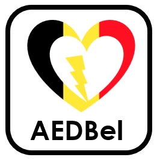

# AEDBel: A quick AED-searching application

## Introduction

AEDBel is an application developed, deployed and operated by Group Italy from KU Leuven for the course Modern Data Analytics. The application is designed for saving rescuers more valuable time whenever a cardiac arrest happen. Based on optimized AED locations, AEDBel requests users' location to calculate the nearest AED in a short time. It provides walking/driving mode in terms of suggesting routes. It also displays points of interest and estimated time of arrival considering the rushy scenario. Besides, some tutorial videos about AED operation and CPR could be found in the APP.

## Members ##
AEDBel is deveopled, deployed and operated by Group Italy. Group Italy has four members.

Massimo Gerecitano

Moqian Chen

Jorge Puertolas Molina

Shyam Krishna Selvan

## Maintainance ##

The application is deployed using Heroku. Please click here if you would like to visit the application.

